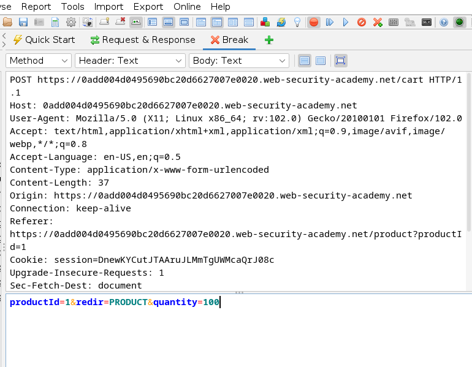
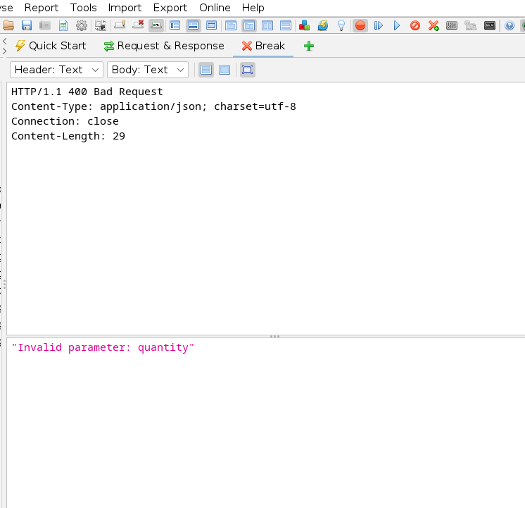
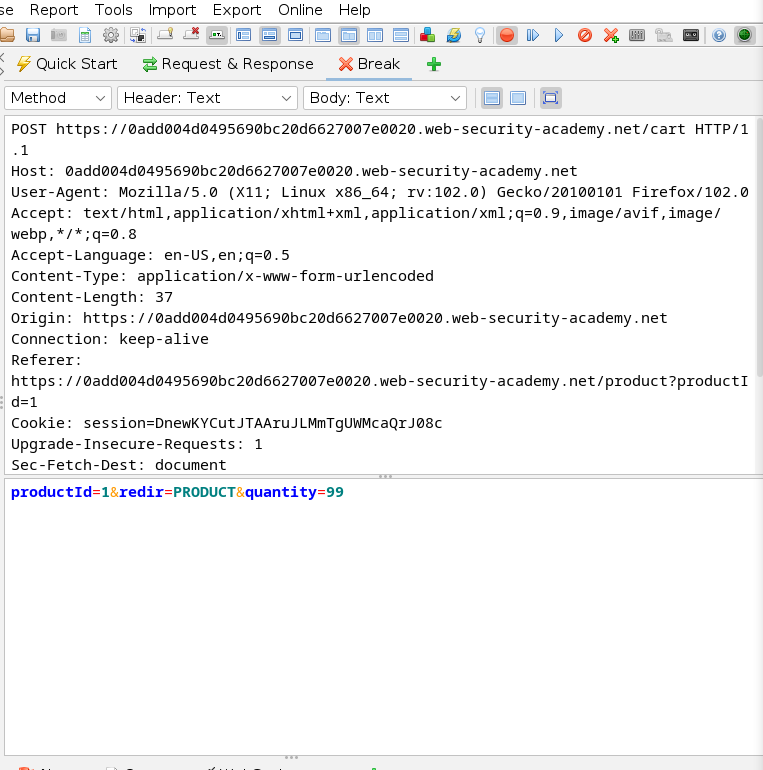
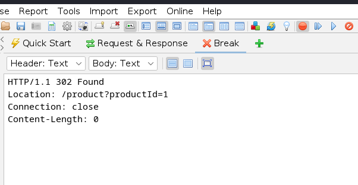
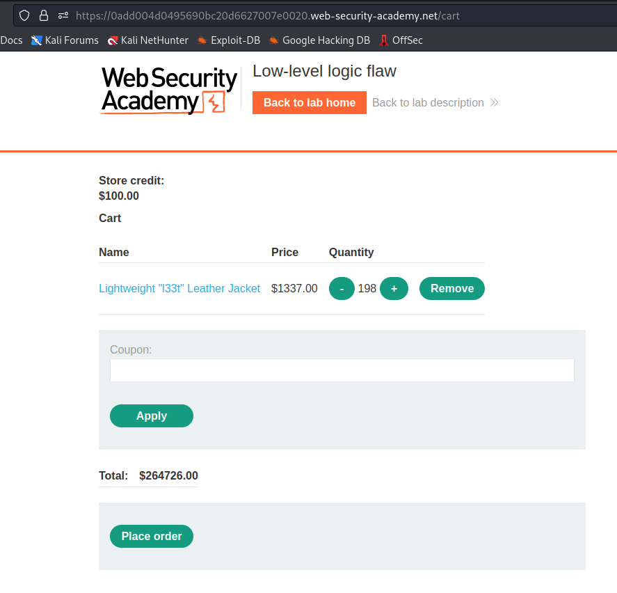
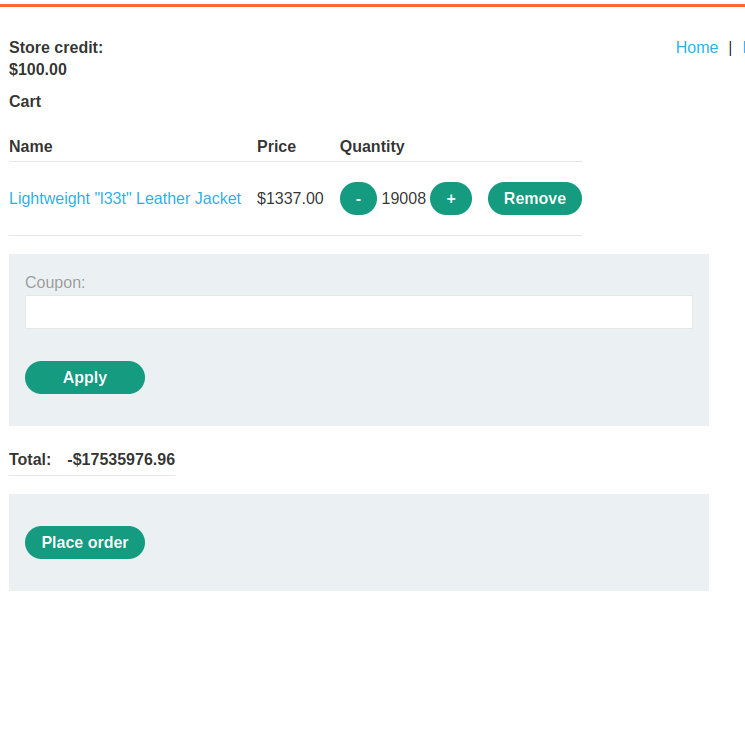
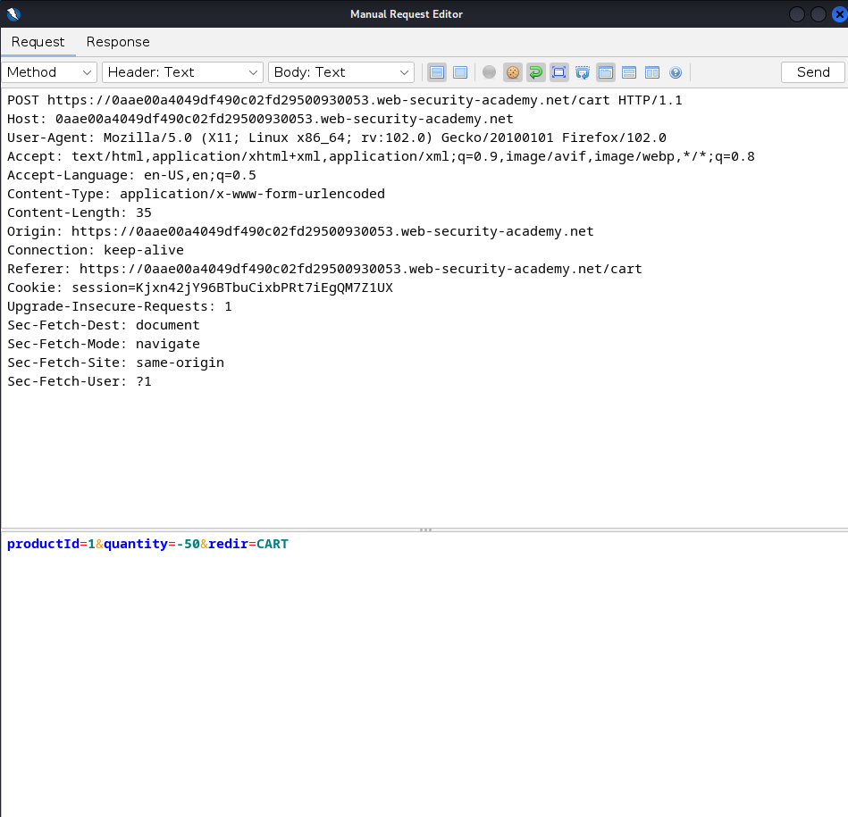
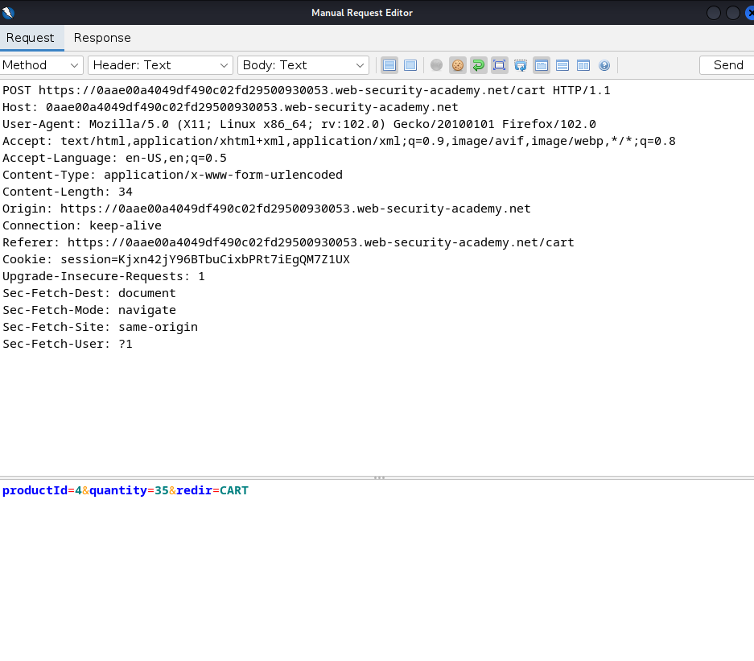
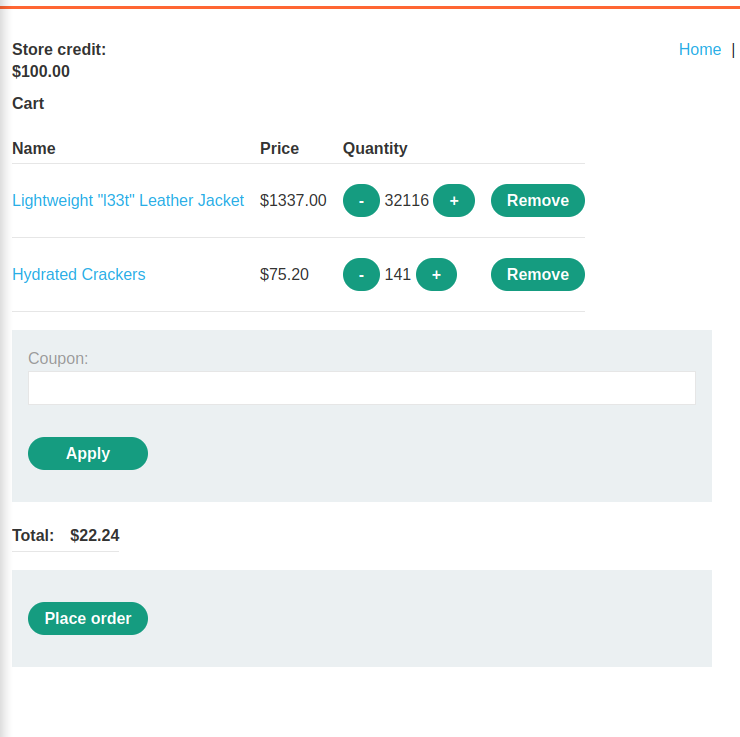
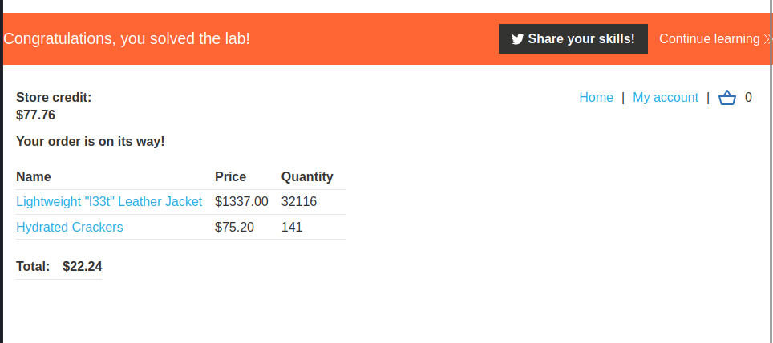

# Low-level logic flaw 

1. After logging in, I added "Lightweight "l33t" Leather Jacket" to cart, tried to buy it and message "Not enough store credit for this purchase" occurred. 
2. After analyzing adding to cart and buying operations, I figured out that I can't add more than 99 products with each request, but I can send this request multiple times, it means if I send request with intention of adding 198 products to cart, it will give me an error, but if I send two requests which add to cart 99 products each, there won't be any error and 198 products will be in the cart.    







3. I decided to check if [integer overflow](https://en.wikipedia.org/wiki/Integer_overflow) occurs.

4. I wrote a python script, which sends a request that adds 99 jackets to cart and count how many requests were sent. I ran this script and started refreshing the site. After a while, price started to show negative number, so integer overflow occurred. 

```
import requests

def main():
    url = "https://0aae00a4049df490c02fd29500930053.web-security-academy.net/cart"
    run = True
    i = 0
    while(run):
        r = requests.post(url, data={'productId':1,'redir':'CART','quantity':99}, cookies={'session':'Kjxn42jY96BTbuCixbPRt7iEgQM7Z1UX'})
        i += 1
        print(str(i) + ' - ' + str(r.status_code))

if __name__ == '__main__':
    main()
```


5. I noticed that around the 320th request, the price became positive again, so I stopped the script and started adjusting the quantity of products by removing them, to bring the price to be slightly below $0. Then I added a few lower priced products to better adjust the price. End up with a total of $22.24 to pay.  





6. I clicked "Place order" button and saw a summary of my order with congratulation message, because the lab is solved. 

