# Authentication bypass via encryption oracle

1. I logged in with given credentials and marked "Stay logged in" option, while analyzing the logging in operation I noticed that there is a "stay-logged-in" cookie with encrypted value.

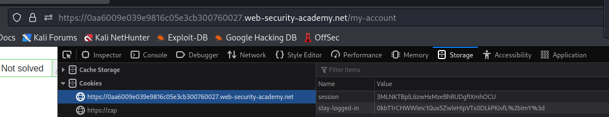

2. After analyzing the domain, I found out another cookie (notification=KjJkERAiMgGCezLyx8%2b6yNgtet6I7vV5sQBED4E6W70%3d), which is set up after giving wrong address email, while commenting. And after failed comment, the error occurs.

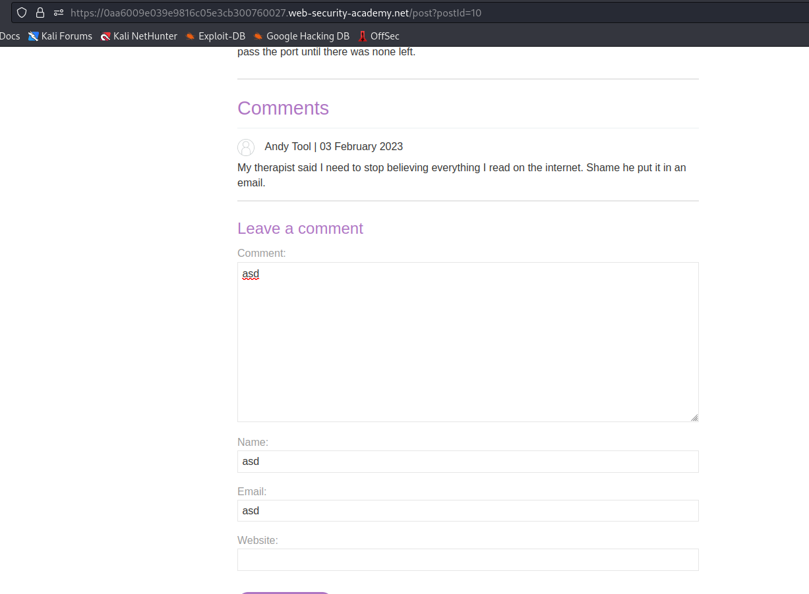

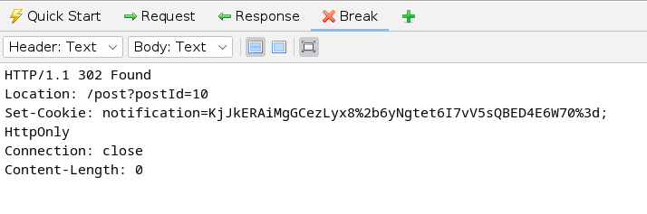

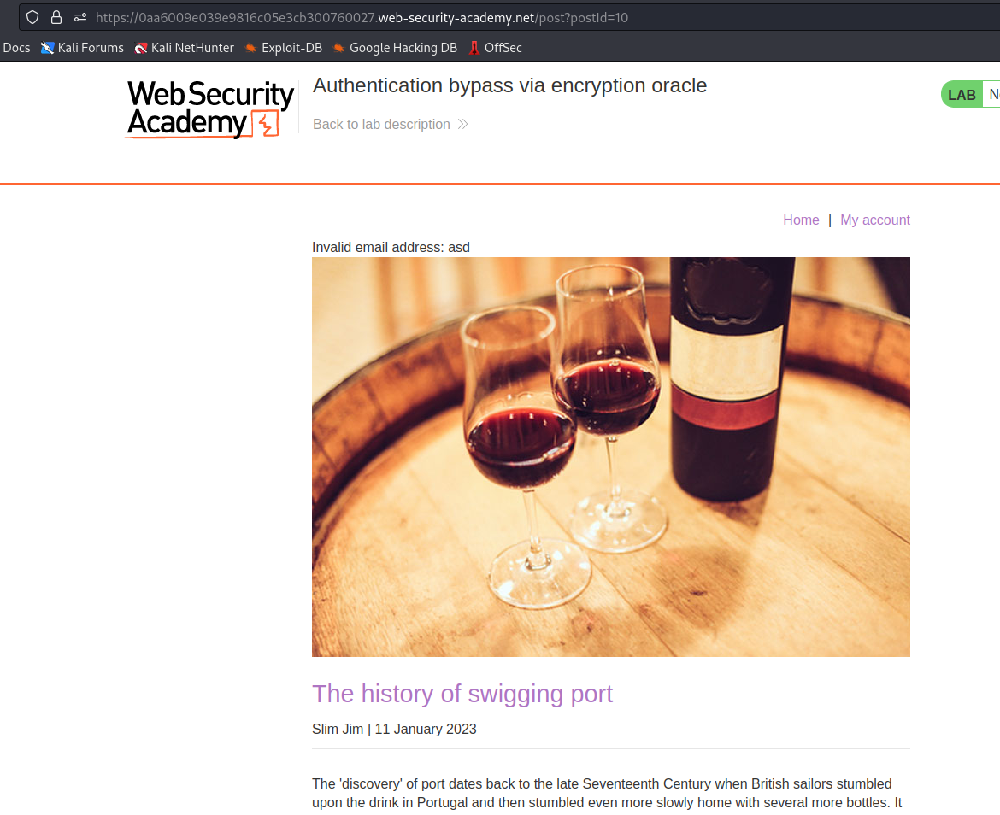

3. When, in post's GET request, I put the value of "stay-logged-in" cookie into "notification" cookie, except of error message I got decrypted content of "stay-logged-in" cookie, which is "wiener:1675788781469". I knew then, that the "stay-logged-in" cookie is an encrypted in format user:timestamp. 

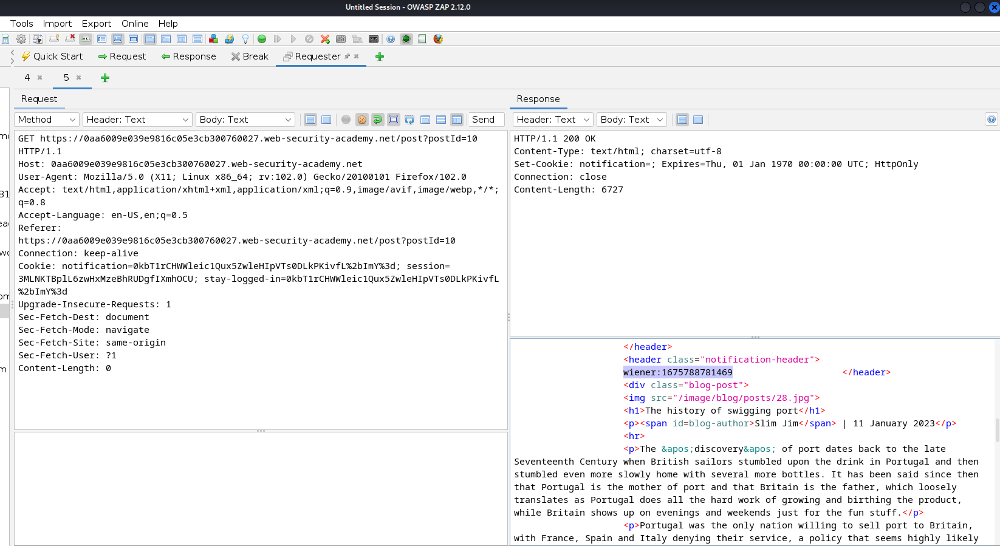

4. I named comment's POST request "encrypt" and post's GET request "decrypt". 

5. I decided to encrypt administrator:my-timestamp and it worked, but then I needed to get rid of the first 23 characters of the decrypted message "Invalid email address: ". 

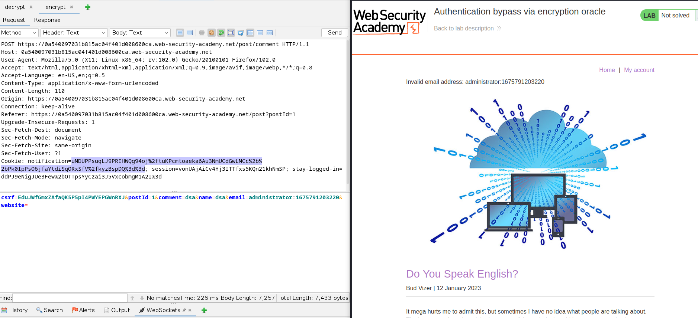

6. In Burp decoder I firstly URL-decoded, then Base64-decoded and then deleted first 23 bytes. When I removed this prefix, I re-encoded the message and tried to decrypt it. 

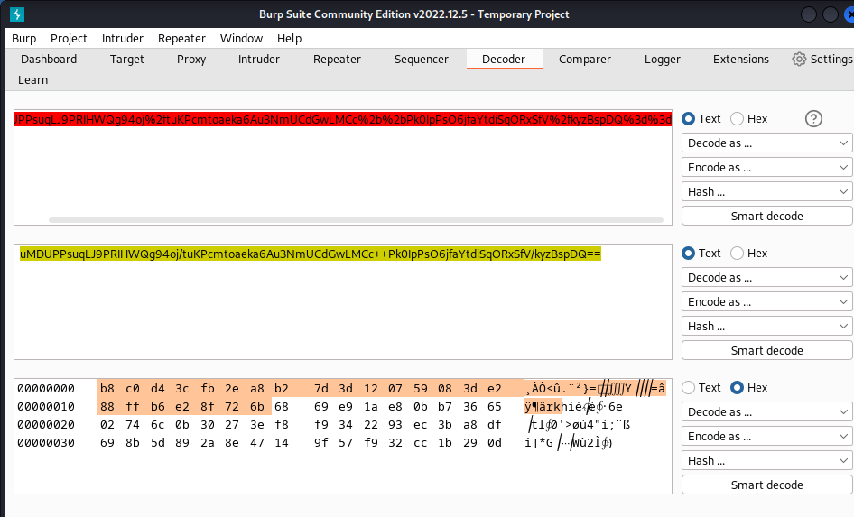

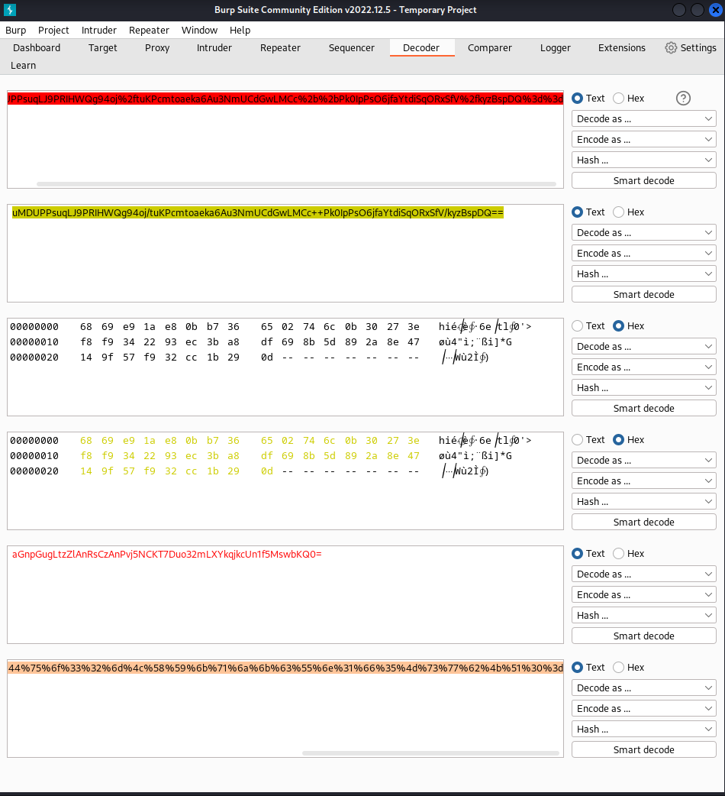

7. After I sent a request except of decrypted message I got an error saying "Input length must be multiple of 16 when decrypting with padded cipher", so I added 9 letters of padding, before administrator. 

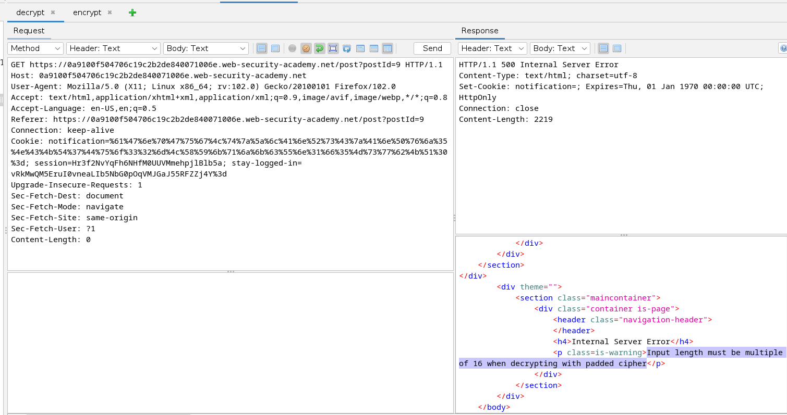

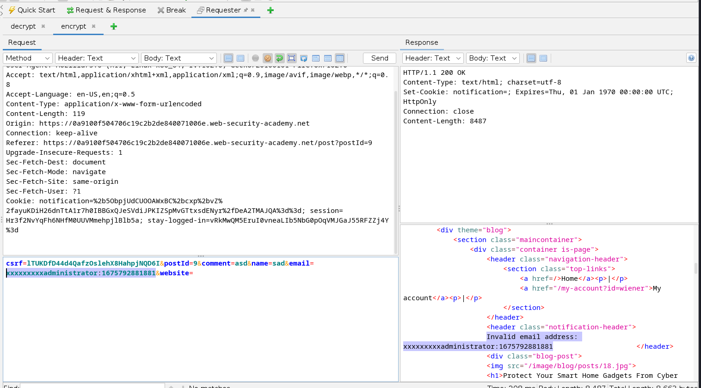

8. In Burp decoder, I've done the same, but this time I removed 32 bytes. 

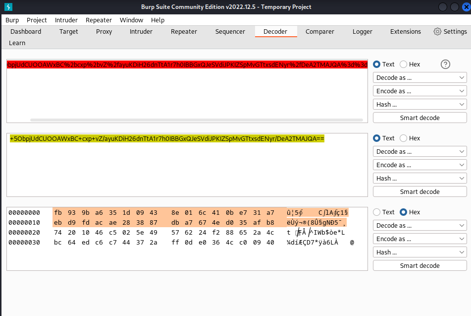

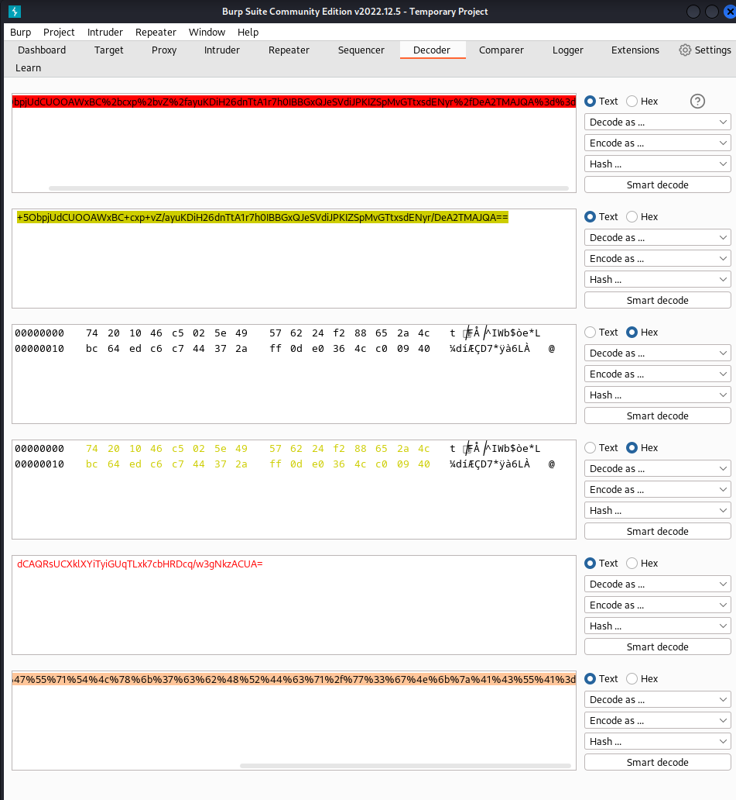

9. Finally, I constructed a right value, to insert into the stay-logged-in cookie. 

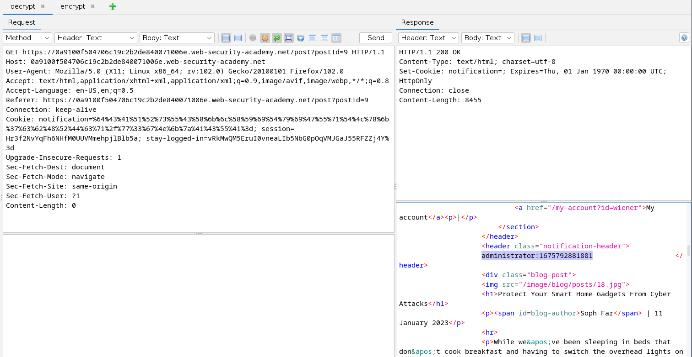

10. I intercepted the request to an admin panel, removed a session cookie and changed the value of "stay-logged-in" cookie to crafted message. I accessed the admin panel and removed carlos. The lab is solved. 

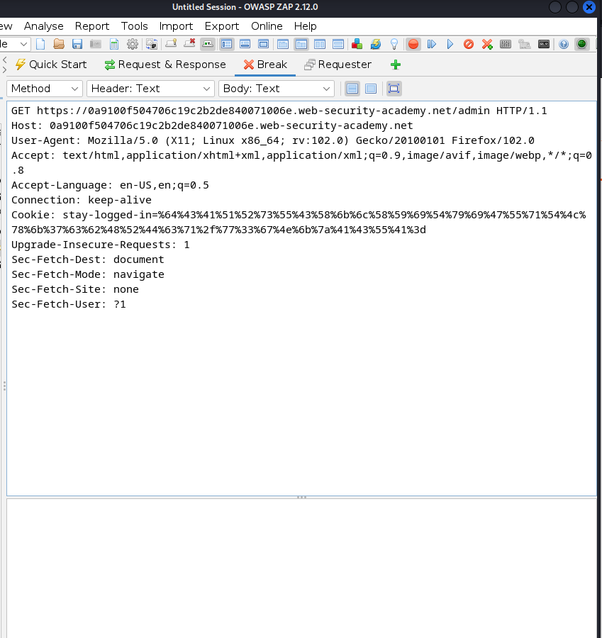

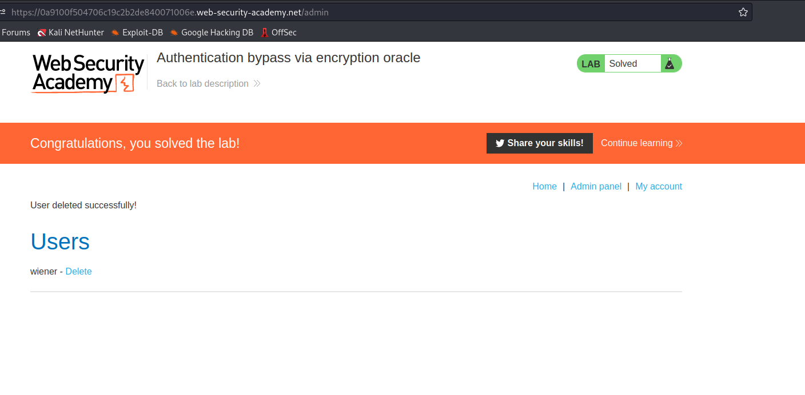

