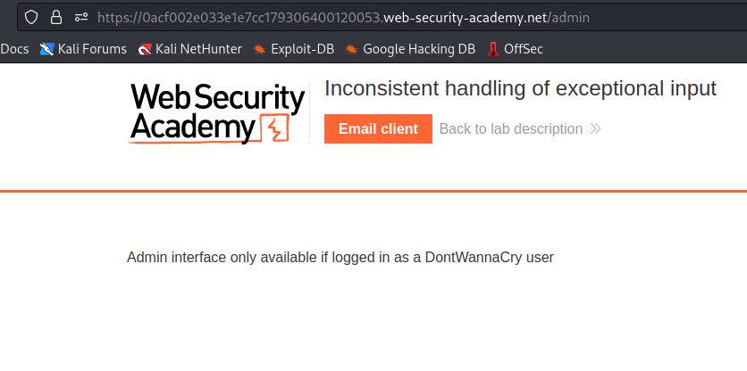
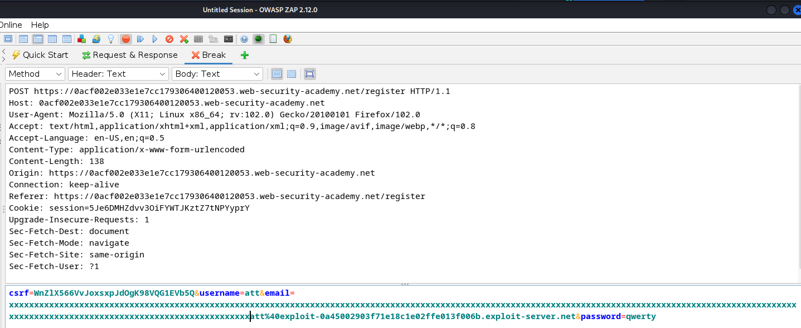
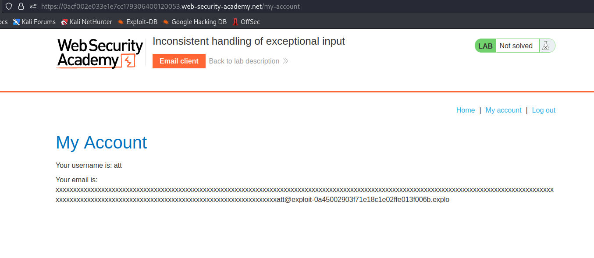
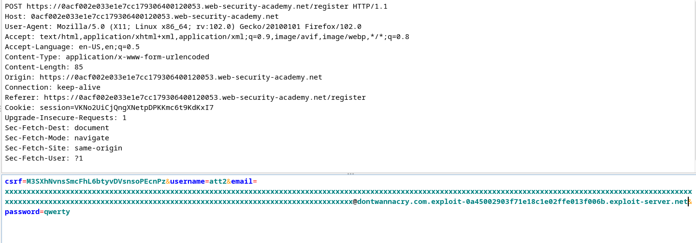
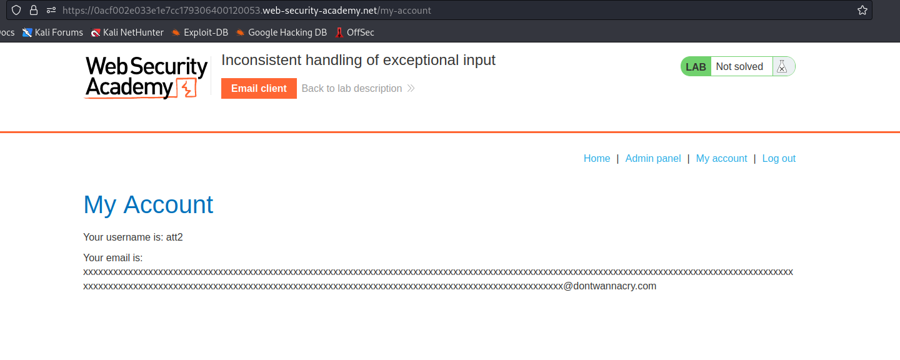
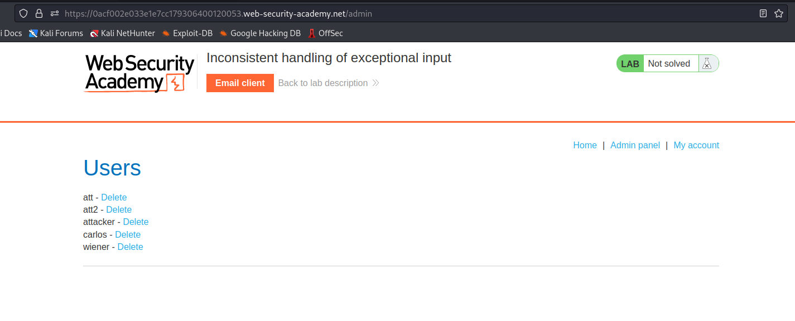
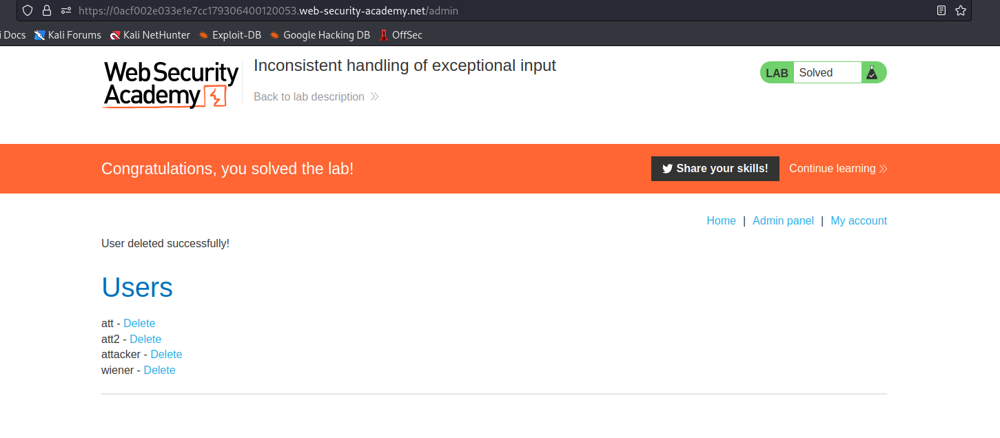

# Inconsistent handling of exceptional input

1. The goal is to delete carlos, so I guessed that I need some kind of admin panel. I added "/admin" at the end of the target's address. It looked like the domain exist, but it's only available for DontWannaCry users. 

2. I didn't have access to any account, but I had register option, so I started analyzing the process of signing up, realized that I can add really long string in email parameter and finished registration process without any problems.  

3. After logging in, I noticed that my email address is truncated after the 255th character. 

4. I logged out and decided to register one more account, but with specially created email address xxxxxxxxxxxxxxxxxxxxxxxxxxxxxxxxxxxxxxxxxxxxxxxxxxxxxxxxxxxxxxxxxxxxxxxxxxxxxxxxxxxxxxxxxxxxxxxxxxxxxxxxxxxxxxxxxxxxxxxxxxxxxxxxxxxxxxxxxxxxxxxxxxxxxxxxxxxxxxxxxxxxxxxxxxxxxxxxxxxxxxxxxxxxxxxxxxxxxxxxxxxxxxxxxxxxxxxxxxxxxxxxxxxxxxxxxxxxxx@dontwannacry.com.exploit-0a45002903f71e18c1e02ffe013f006b.exploit-server.net, where "m" in dontwannacry.com is 255th character. 

5. My email ends with @dontwannacry.com, I can access admin panel and delete carlos. Lab is solved :D 

